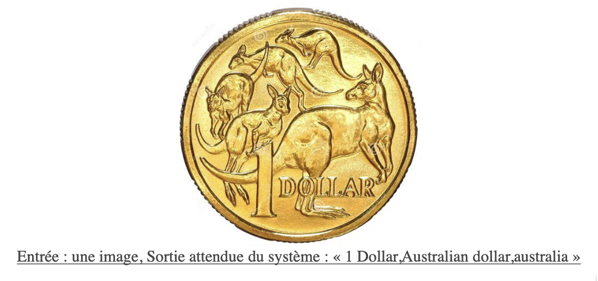

## _Classification de pièces_

### ***Master 1 Informatique VMI - Rayane KHATIM***

#### ***Objectif*** : on dispose d’une image représentant une pièce. Concevoir un programme reposant sur un CNN permettant, à partir d’une image donnée, de prédire la classe de la pièce. 



Consignes :
- Implémenter ***une méthode par CNN*** pour la classification des pièces. On utilisera le modèle AlexNet.
- Evaluer ***les performances du système sur la base donnée*** et se comparer aux ***performances du LeaderBoard du challenge Kaggle***.
- Critiquer ***la solution existante*** et proposer ***des axes d'améliorations***.

***Structure architecturale*** :

```
TP_2.2_CNN_MONNAIE/
|- __pycache__
|- env
|- kaggle
  |- test/
  |- train/
  |- sample_submission.csv
  |- test.csv
  |- train.csv
|- best_alexnet.pth
|- dataset.py
|- evaluate.py
|- main.py
|- model.py
|- README.md
|- TP_CNN_monnaie.pdf
|- train.py
```
***Execution du programme*** :

```
python3 -m venv env    
source env/bin/activate 
python main.py
```
***Résultats de l'accuracy de validation*** :

```
Accuracy globale: 0.7687 (76.87%)
```
***Langages de programmation*** :
- Python

***Librairies/Bibliothèques*** :
- pandas
- torch
- torchvision
- PIL
- sklearn
- matplotlib
- numpy


